# MetaMask & Snaps: Architecture & User Experience Guide

## Table of Contents
1. [What is MetaMask?](#what-is-metamask)
2. [What is a Snap?](#what-is-a-snap)
3. [Relationship Between MetaMask & Snaps](#relationship-between-metamask--snaps)
4. [How We're Using Snaps](#how-were-using-snaps)
5. [Private Key Sources & Security Model](#private-key-sources--security-model)
6. [Our End Product Architecture](#our-end-product-architecture)
7. [User Experience Flows](#user-experience-flows)
8. [Security & Privacy Considerations](#security--privacy-considerations)

---

## What is MetaMask?

**MetaMask** is a cryptocurrency wallet that exists as a browser extension (Chrome, Firefox, Edge, Brave) and mobile app.

### Key Features:
- **Web3 Gateway**: Allows websites to interact with blockchain networks (Ethereum, Polygon, etc.)
- **Private Key Management**: Stores and manages users' private keys securely
- **Transaction Signing**: Signs transactions without exposing private keys to websites
- **Multi-Chain Support**: Works with Ethereum and EVM-compatible chains
- **Browser Extension**: Runs in a sandboxed environment for security

### Architecture Overview

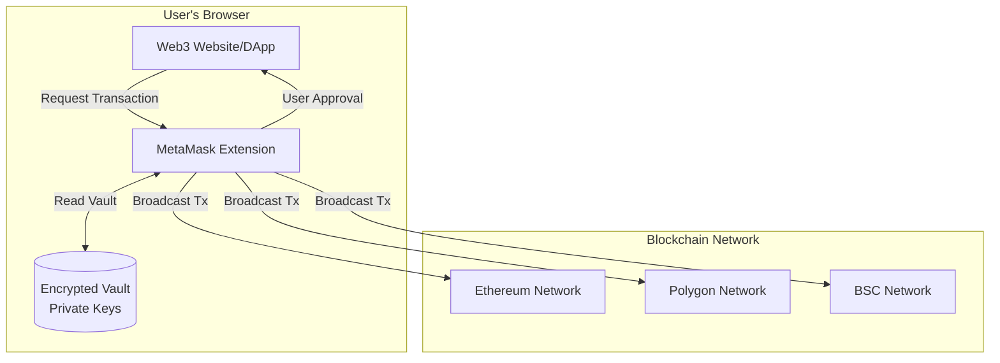

### How MetaMask Stores Keys (Traditional)

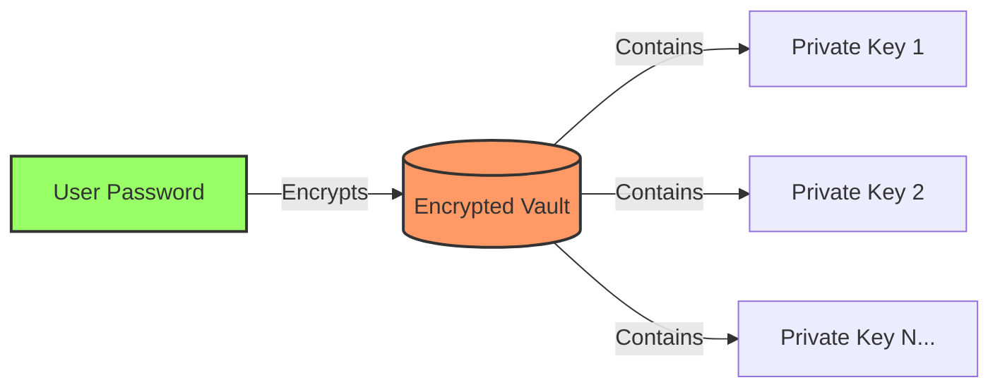

**Problem**: If user loses password or vault is compromised, **all funds are lost**.

---

## What is a Snap?

**MetaMask Snaps** is a plugin system that allows developers to extend MetaMask's functionality with custom features.

### Key Characteristics:

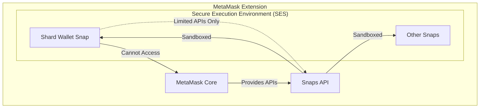

### Snap Capabilities & Restrictions

| **Capability** | **Allowed** | **Not Allowed** |
|----------------|-------------|-----------------|
| Custom RPC methods | ✅ Yes | ❌ Access MetaMask keys |
| Store encrypted data | ✅ Yes (via State API) | ❌ Access browser localStorage |
| Show custom UI dialogs | ✅ Yes | ❌ Access DOM directly |
| Schedule cron jobs | ✅ Yes | ❌ Make arbitrary network calls |
| Pure JavaScript code | ✅ Yes | ❌ WebAssembly (not yet supported) |

### Security Model

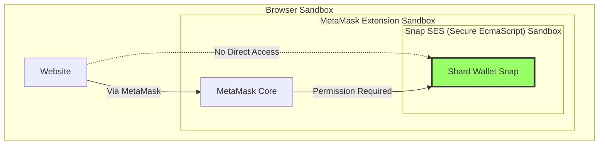

**Triple Sandboxing**:
1. Browser sandbox (extension isolation)
2. MetaMask sandbox (extension security)
3. SES sandbox (Snap isolation)

---

## Relationship Between MetaMask & Snaps

### Analogy: Smartphone & Apps

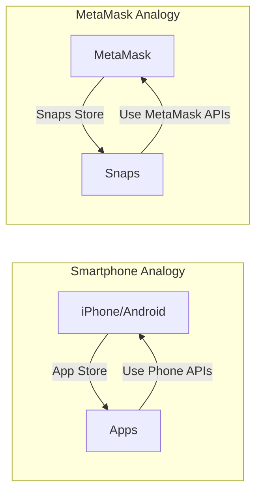

| **Smartphone** | **MetaMask** |
|----------------|--------------|
| Operating System | MetaMask Core |
| App Store | Snaps Marketplace |
| Apps (Instagram, WhatsApp) | Snaps (Shard Wallet, others) |
| Phone APIs (Camera, GPS) | MetaMask APIs (State, Notify, RPC) |
| App Permissions | Snap Permissions |

### How They Communicate

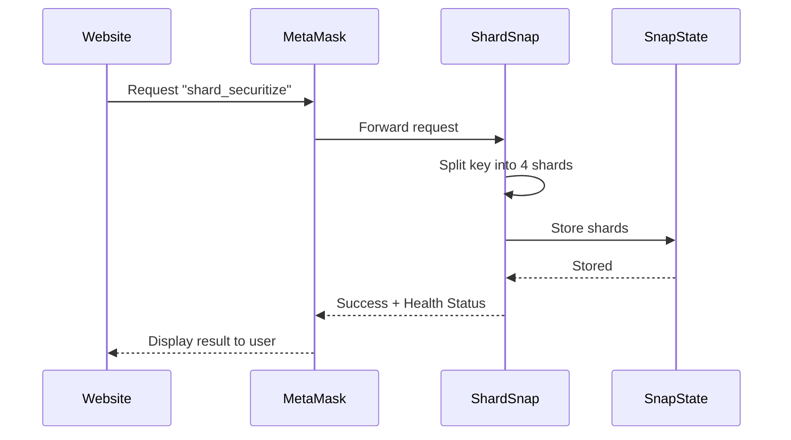

---

## How We're Using Snaps

### Our Implementation: Shard Wallet Snap

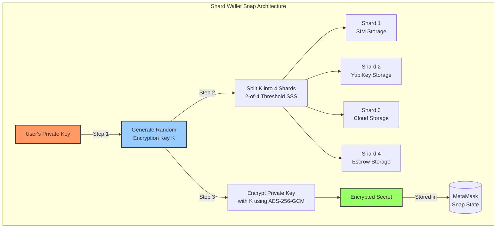

### Technology Stack

```mermaid
graph LR
    subgraph "Pure JavaScript Crypto"
        SSS[Shamir Secret Sharing<br/>secrets.js]
        AES[AES-256-GCM<br/>@noble/ciphers]
        Random[Secure Random<br/>crypto.getRandomValues]
    end

    subgraph "Storage"
        State[MetaMask Snap State API<br/>snap_manageState]
    end

    subgraph "MetaMask APIs Used"
        RPC[endowment:rpc<br/>Custom Methods]
        Notify[snap_notify<br/>User Notifications]
        Lifecycle[endowment:lifecycle-hooks<br/>onInstall, onUpdate]
        Cron[endowment:cronjob<br/>Daily Health Checks]
    end

    SSS --> Snap[Shard Wallet Snap]
    AES --> Snap
    Random --> Snap
    Snap --> State
    Snap --> RPC
    Snap --> Notify
    Snap --> Lifecycle
    Snap --> Cron
```

### Why We Chose Snaps

| **Requirement** | **Why MetaMask Snaps?** |
|-----------------|-------------------------|
| No separate app installation | ✅ Works inside existing MetaMask extension |
| Users already trust MetaMask | ✅ 30+ million existing users |
| Secure execution environment | ✅ Triple-sandboxed (Browser + MetaMask + SES) |
| Access to wallet context | ✅ Can interact with user's wallet without accessing keys |
| Built-in permission system | ✅ User controls what Snap can do |
| Cross-platform | ✅ Works on Chrome, Firefox, Edge, Brave, Mobile (future) |

---

## Private Key Sources & Security Model

### Critical Question: Where Does The Private Key Come From?

**Short Answer**: The private key **NEVER** goes to our website's backend. It flows through 3 possible paths:

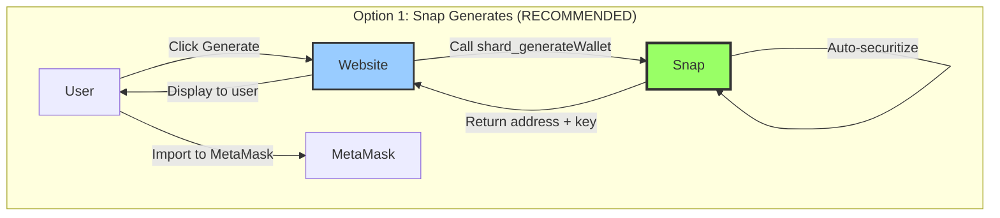

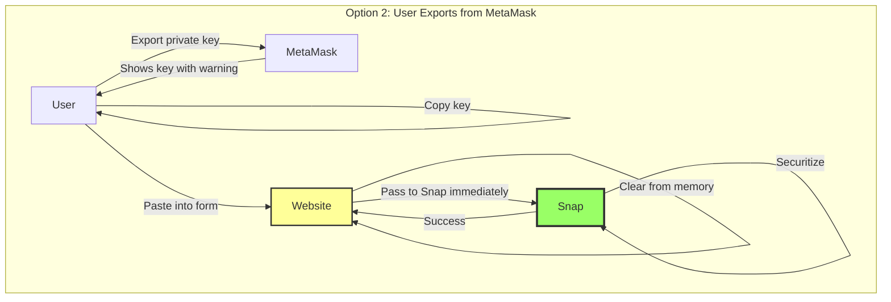

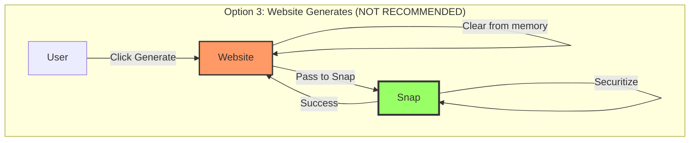

### Detailed Flow Analysis

#### **Option 1: Snap Generates Wallet (RECOMMENDED ✅)**

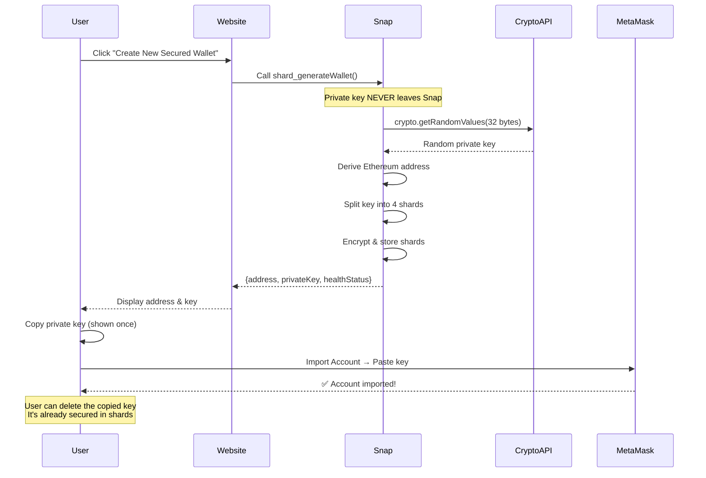

**Advantages:**
- ✅ **Most Secure**: Private key generated inside Snap's sandbox
- ✅ **Zero Trust**: Website never has the key in memory
- ✅ **Auto-Securitized**: Key is split immediately after generation
- ✅ **One-Click UX**: Single action generates + secures wallet

**Implementation:**
```javascript
// Website code
const result = await window.ethereum.request({
  method: 'wallet_invokeSnap',
  params: {
    snapId: 'local:http://localhost:9000',
    request: {
      method: 'shard_generateWallet',
      params: {}  // No parameters needed
    }
  }
});

// User sees:
// Address: 0x742d...
// Private Key: 0x1234... (shown once for import to MetaMask)
// ✅ Wallet secured! 4/4 shards healthy
```

---

#### **Option 2: User Exports from Existing MetaMask Wallet**

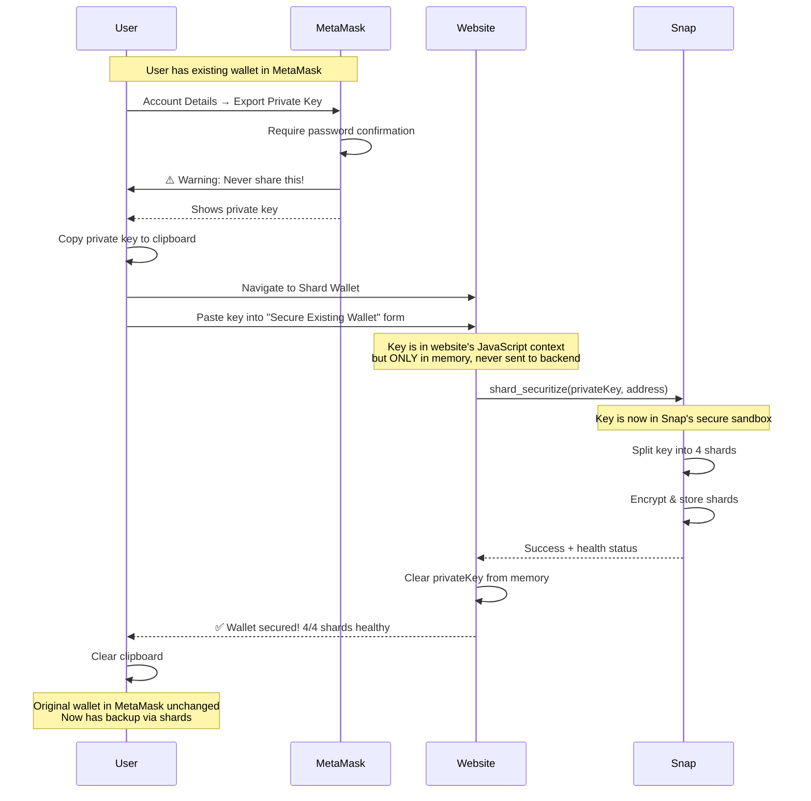

**Advantages:**
- ✅ Works with existing wallets
- ✅ No new wallet needed
- ✅ User controls the key export

**Security Considerations:**
- ⚠️ Private key briefly exists in website's JavaScript memory
- ⚠️ Could be intercepted by malicious browser extensions
- ⚠️ User must trust the website frontend code
- ⚠️ Risk of phishing (fake website could steal key)

**Mitigations:**
```javascript
// Website code - good practices
const securitizeExistingWallet = async (privateKey, address) => {
  try {
    // 1. Pass to Snap immediately (don't store in variables)
    const result = await window.ethereum.request({
      method: 'wallet_invokeSnap',
      params: {
        snapId: 'local:http://localhost:9000',
        request: {
          method: 'shard_securitize',
          params: { privateKey, address }
        }
      }
    });

    return result;
  } finally {
    // 2. Clear from memory immediately after
    privateKey = null;

    // 3. Force garbage collection (hint to browser)
    if (global.gc) global.gc();
  }
};
```

---

#### **Option 3: Website Generates Wallet (NOT RECOMMENDED ⚠️)**

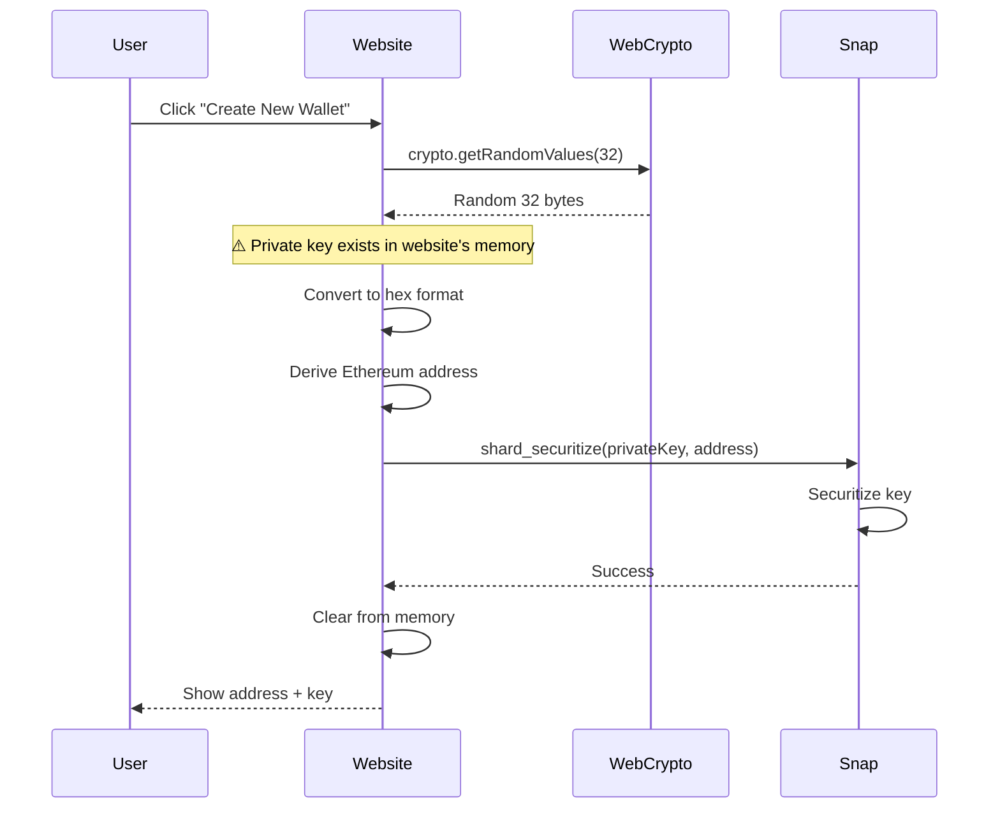

**Why NOT Recommended:**
- ❌ Private key exists in website's JavaScript context
- ❌ Vulnerable to XSS attacks
- ❌ Could be logged by debugging tools
- ❌ Requires users to trust website code
- ❌ Risk of malicious code injection
- ❌ Browser extensions could intercept

**When It Might Be Acceptable:**
- ✅ Open-source website (users can verify code)
- ✅ Running locally (localhost, no remote code)
- ✅ Audited codebase
- ✅ Used in development/testing only

---

### Security Comparison Table

| **Aspect** | **Snap Generates** | **User Exports** | **Website Generates** |
|-----------|-------------------|------------------|----------------------|
| **Private key in website memory** | ❌ Never | ⚠️ Briefly | ⚠️ Yes |
| **Vulnerable to XSS** | ❌ No | ⚠️ Low risk | ❌ Yes |
| **Trust required** | ✅ Only Snap | ⚠️ Website frontend | ❌ Website fully |
| **Phishing risk** | ✅ Low | ⚠️ Medium | ❌ High |
| **Browser extension intercept** | ❌ Cannot | ⚠️ Possible | ❌ Possible |
| **Backend ever sees key** | ✅ Never | ✅ Never | ✅ Never |
| **User Experience** | ✅ Excellent | ⚠️ Manual steps | ✅ Good |
| **Use Case** | New wallets | Existing wallets | Not recommended |

---

### Data Flow: Where Key Travels

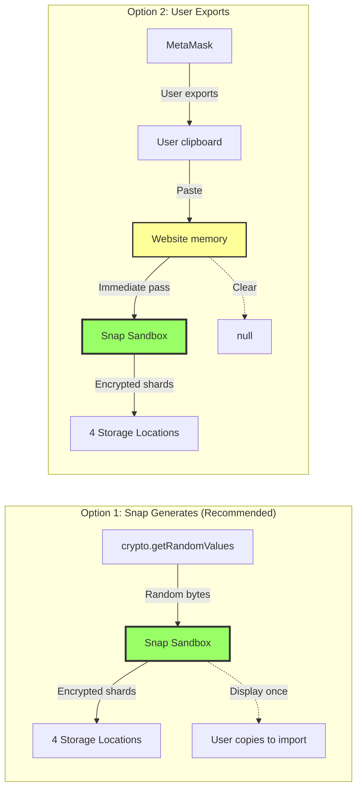

---

### Important: What Website NEVER Does

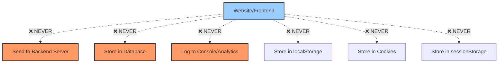

**Website's ONLY role:**
1. Display UI to user
2. Call Snap methods
3. Display results from Snap
4. Clear any sensitive data from memory immediately

---

### Recommended Implementation Strategy

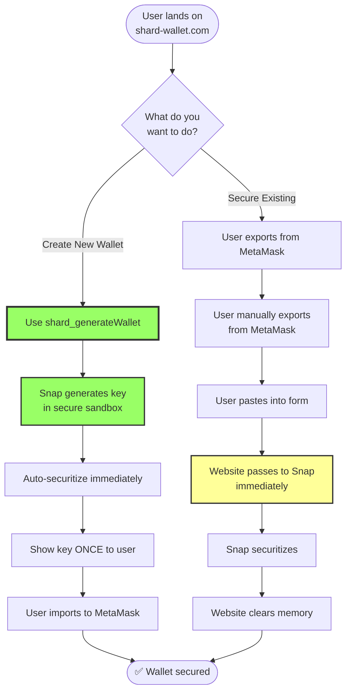

---

### Code Example: Secure Implementation

**Recommended: Snap Generates**
```javascript
// Website code
async function createNewSecuredWallet() {
  try {
    const result = await window.ethereum.request({
      method: 'wallet_invokeSnap',
      params: {
        snapId: 'local:http://localhost:9000',
        request: {
          method: 'shard_generateWallet',
          params: {}
        }
      }
    });

    // Result contains:
    // - walletAddress: "0x742d..."
    // - privateKey: "0x1234..." (for import to MetaMask)
    // - healthStatus: { sim: "healthy", ... }

    return result;
  } catch (error) {
    console.error('Failed to generate wallet:', error);
    throw error;
  }
}
```

**Alternative: Secure Existing Wallet**
```javascript
// Website code
async function securitizeExistingWallet(privateKey, address) {
  try {
    // Validate inputs client-side first
    if (!privateKey.match(/^0x[0-9a-fA-F]{64}$/)) {
      throw new Error('Invalid private key format');
    }

    // Pass to Snap immediately - don't store anywhere
    const result = await window.ethereum.request({
      method: 'wallet_invokeSnap',
      params: {
        snapId: 'local:http://localhost:9000',
        request: {
          method: 'shard_securitize',
          params: { privateKey, address }
        }
      }
    });

    return result;

  } finally {
    // Clear from memory (JavaScript can't truly delete, but helps)
    privateKey = '0'.repeat(66);
    address = '';
  }
}
```

---

## Our End Product Architecture

### Complete System Overview

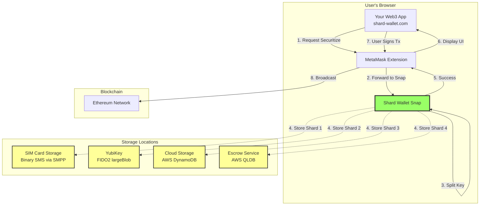

### Product Features

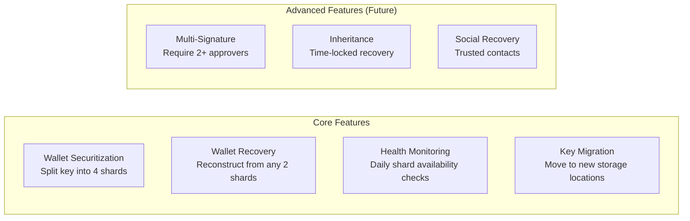

### Data Flow: Securitization

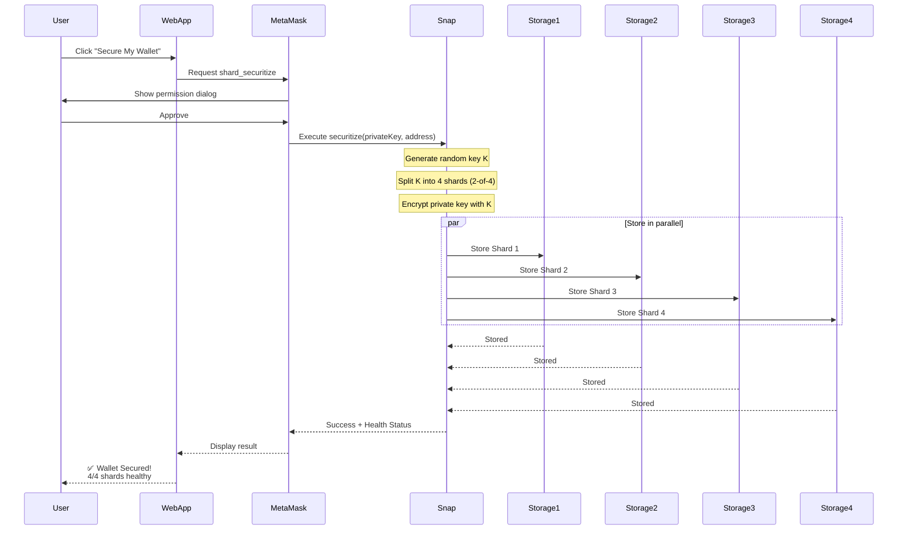

### Data Flow: Recovery

```mermaid
sequenceDiagram
    participant User
    participant WebApp
    participant MetaMask
    participant Snap
    participant Storage1
    participant Storage2

    User->>WebApp: Click "Recover My Wallet"
    WebApp->>MetaMask: Request shard_recover
    MetaMask->>Snap: Execute recover(address)

    par Retrieve shards
        Snap->>Storage1: Get Shard 1
        Snap->>Storage2: Get Shard 2
    end

    Storage1-->>Snap: Shard 1 data
    Storage2-->>Snap: Shard 2 data

    Note over Snap: Reconstruct key K from 2 shards
    Note over Snap: Decrypt private key with K

    Snap-->>MetaMask: Private key recovered
    MetaMask-->>WebApp: Return private key
    WebApp-->>User: ✅ Wallet Recovered!<br/>Import to MetaMask?
```

---

## User Experience Flows

### New User Journey

```mermaid
journey
    title New User Experience
    section Discovery
      Visit shard-wallet.com: 5: User
      Learn about security: 4: User
      Click "Get Started": 5: User
    section Setup
      Install MetaMask (if needed): 3: User
      Create MetaMask wallet: 4: User
      Install Shard Wallet Snap: 4: User
      Approve permissions: 3: User
    section Securitization
      Click "Secure My Wallet": 5: User
      Confirm transaction: 4: User
      Wait for shards to store: 3: User
      See success message: 5: User
    section Usage
      Use wallet normally: 5: User
      Receive health notifications: 4: User
      Sleep peacefully: 5: User
```

### Step-by-Step: New User

```mermaid
graph TD
    Start([New User Visits<br/>shard-wallet.com]) --> HasMM{Has MetaMask?}

    HasMM -->|No| InstallMM[Install MetaMask<br/>Extension]
    InstallMM --> CreateWallet[Create New Wallet<br/>in MetaMask]

    HasMM -->|Yes| ConnectSite[Click Connect Wallet]
    CreateWallet --> ConnectSite

    ConnectSite --> MMApprove[MetaMask: Approve<br/>site connection]
    MMApprove --> ShowDashboard[See Shard Wallet<br/>Dashboard]

    ShowDashboard --> InstallSnap[Click Enable<br/>Shard Protection]
    InstallSnap --> SnapPermissions[MetaMask: Review<br/>Snap Permissions]

    SnapPermissions --> PermList[✓ Store data<br/>✓ Send notifications<br/>✓ Daily health checks]
    PermList --> ApproveSnap[Click Approve]

    ApproveSnap --> SnapInstalled[✅ Snap Installed]
    SnapInstalled --> Choice{New or<br/>Existing?}

    Choice -->|New Wallet| Generate[Click Generate<br/>New Secured Wallet]
    Choice -->|Existing Wallet| Export[Export key from MetaMask<br/>and paste into form]

    Generate --> SnapGenerates[Snap generates key<br/>in secure sandbox]
    SnapGenerates --> AutoSecure[Auto-securitize]

    Export --> UserPastes[User pastes key]
    UserPastes --> Securitize[Click Securitize]

    Securitize --> Processing[⏳ Splitting key...<br/>⏳ Storing shards...]
    AutoSecure --> Processing

    Processing --> Success[✅ Wallet Secured!<br/>4/4 shards healthy]
    Success --> UseWallet[Use wallet normally]

    style Success fill:#9f6,stroke:#333,stroke-width:3px
    style SnapInstalled fill:#9cf,stroke:#333,stroke-width:2px
    style Generate fill:#9f6,stroke:#333,stroke-width:2px
```

### Existing MetaMask User Journey

```mermaid
journey
    title Existing MetaMask User Experience
    section Discovery
      See Shard Wallet announcement: 4: User
      Visit shard-wallet.com: 5: User
      Connect existing wallet: 5: User
    section Installation
      Click "Install Snap": 5: User
      Review permissions: 4: User
      Approve in 1 click: 5: User
    section Securitization
      Select wallet to secure: 4: User
      Confirm securitization: 4: User
      See shards distribute: 3: User
      Get confirmation: 5: User
    section Daily Use
      Use wallet as normal: 5: User
      No extra steps needed: 5: User
      Peace of mind: 5: User
```

### Comparison: Traditional vs Shard Wallet

| **Scenario** | **Traditional MetaMask** | **With Shard Wallet Snap** |
|--------------|--------------------------|----------------------------|
| Forgot password | 🔴 Lose all funds (unless seed phrase saved) | 🟢 Recover from 2 shards |
| Lost seed phrase | 🔴 Lose all funds | 🟢 Recover from 2 shards |
| Computer hacked | 🔴 Attacker gets password = all funds stolen | 🟢 Attacker needs 2 shards from different locations |
| Phone stolen | 🔴 If unlocked, funds at risk | 🟢 Still need 1+ more shard |
| Setup complexity | 🟢 Simple: password + seed phrase | 🟡 Moderate: + Snap installation |
| Daily usage | 🟢 No difference | 🟢 No difference |

---

## User Experience: Detailed Mockups

### Installation Flow

```
┌─────────────────────────────────────────────┐
│  Shard Wallet - Get Started                 │
├─────────────────────────────────────────────┤
│                                             │
│  🔐 Secure Your Crypto Wallet               │
│                                             │
│  Split your private key into 4 shards.      │
│  Store them in different locations.         │
│  Recover with any 2 shards.                 │
│                                             │
│  ┌─────────────────────────────────────┐   │
│  │  [Install Shard Wallet Snap]        │   │
│  └─────────────────────────────────────┘   │
│                                             │
│  Already have MetaMask? ✅                  │
│  Don't have MetaMask? [Install MetaMask]    │
│                                             │
└─────────────────────────────────────────────┘

            ↓ User clicks "Install Shard Wallet Snap"

┌─────────────────────────────────────────────┐
│  MetaMask - Install Snap                     │
├─────────────────────────────────────────────┤
│                                             │
│  📦 Shard Wallet Snap                       │
│  By: Shard Team                             │
│                                             │
│  This Snap wants permission to:             │
│                                             │
│  ✓ Store encrypted data                    │
│  ✓ Send you notifications                  │
│  ✓ Run daily health checks                 │
│  ✓ Communicate with your dapp              │
│                                             │
│  ⚠️  This Snap cannot access your          │
│      MetaMask private keys                  │
│                                             │
│  [Cancel]              [Install]            │
│                                             │
└─────────────────────────────────────────────┘

            ↓ User clicks "Install"

┌─────────────────────────────────────────────┐
│  Shard Wallet - Dashboard                   │
├─────────────────────────────────────────────┤
│                                             │
│  ✅ Snap installed successfully!            │
│                                             │
│  Your Wallets:                              │
│  ┌───────────────────────────────────────┐ │
│  │ 0x742d...4438f44e              🔓     │ │
│  │ Not Secured                           │ │
│  │ [Secure This Wallet]                  │ │
│  └───────────────────────────────────────┘ │
│                                             │
└─────────────────────────────────────────────┘
```

### Securitization Flow

```
            ↓ User clicks "Secure This Wallet"

┌─────────────────────────────────────────────┐
│  Shard Wallet - Securitize                  │
├─────────────────────────────────────────────┤
│                                             │
│  🔐 Secure Wallet 0x742d...4438f44e         │
│                                             │
│  This will:                                 │
│  1. Split your encryption key into 4 shards │
│  2. Store shards in 4 different locations:  │
│     • SIM Card (Binary SMS)                 │
│     • YubiKey (FIDO2)                       │
│     • Cloud Storage (AWS)                   │
│     • Escrow Service (AWS QLDB)             │
│                                             │
│  You can recover with any 2 shards.         │
│                                             │
│  [Cancel]              [Securitize]         │
│                                             │
└─────────────────────────────────────────────┘

            ↓ User clicks "Securitize"

┌─────────────────────────────────────────────┐
│  Shard Wallet - Processing                  │
├─────────────────────────────────────────────┤
│                                             │
│  ⏳ Securing your wallet...                 │
│                                             │
│  ✓ Generated encryption key                │
│  ✓ Split into 4 shards                     │
│  ⏳ Storing Shard 1 (SIM) ...              │
│  ⏳ Storing Shard 2 (YubiKey) ...          │
│  ⏳ Storing Shard 3 (Cloud) ...            │
│  ⏳ Storing Shard 4 (Escrow) ...           │
│                                             │
│  Please wait...                             │
│                                             │
└─────────────────────────────────────────────┘

            ↓ After ~5 seconds

┌─────────────────────────────────────────────┐
│  Shard Wallet - Success!                    │
├─────────────────────────────────────────────┤
│                                             │
│  ✅ Wallet Secured Successfully!            │
│                                             │
│  Your Wallets:                              │
│  ┌───────────────────────────────────────┐ │
│  │ 0x742d...4438f44e              🔐     │ │
│  │ Secured ✓                             │ │
│  │                                       │ │
│  │ Shard Health:                         │ │
│  │ ✅ SIM Card        Healthy            │ │
│  │ ✅ YubiKey         Healthy            │ │
│  │ ✅ Cloud Storage   Healthy            │ │
│  │ ✅ Escrow Service  Healthy            │ │
│  │                                       │ │
│  │ Overall Status: 🟢 Healthy (4/4)      │ │
│  │                                       │ │
│  │ [Check Health]  [Recover]  [Migrate]  │ │
│  └───────────────────────────────────────┘ │
│                                             │
└─────────────────────────────────────────────┘
```

### Recovery Flow

```
            ↓ User clicks "Recover"

┌─────────────────────────────────────────────┐
│  Shard Wallet - Recover                     │
├─────────────────────────────────────────────┤
│                                             │
│  🔓 Recover Wallet 0x742d...4438f44e        │
│                                             │
│  This will retrieve your private key from   │
│  the stored shards.                         │
│                                             │
│  ⚠️  Warning:                               │
│  Your private key will be displayed.        │
│  Make sure you're in a private location.    │
│                                             │
│  [Cancel]              [Recover]            │
│                                             │
└─────────────────────────────────────────────┘

            ↓ User clicks "Recover"

┌─────────────────────────────────────────────┐
│  Shard Wallet - Processing                  │
├─────────────────────────────────────────────┤
│                                             │
│  ⏳ Recovering your wallet...               │
│                                             │
│  ✓ Retrieved Shard 1 (SIM)                 │
│  ✓ Retrieved Shard 2 (YubiKey)             │
│  ✓ Reconstructed encryption key             │
│  ⏳ Decrypting private key...               │
│                                             │
│  Please wait...                             │
│                                             │
└─────────────────────────────────────────────┘

            ↓ After ~2 seconds

┌─────────────────────────────────────────────┐
│  Shard Wallet - Recovered                   │
├─────────────────────────────────────────────┤
│                                             │
│  ✅ Wallet Recovered Successfully!          │
│                                             │
│  Your Private Key:                          │
│  ┌───────────────────────────────────────┐ │
│  │ 0x1234567890abcdef1234567890abcdef... │ │
│  │                                       │ │
│  │ [Copy]  [Show QR]  [Hide]             │ │
│  └───────────────────────────────────────┘ │
│                                             │
│  ⚠️  Keep this private key safe!            │
│  Anyone with this key can access your funds.│
│                                             │
│  [Import to MetaMask]      [Done]           │
│                                             │
└─────────────────────────────────────────────┘
```

---

## Security & Privacy Considerations

### What MetaMask CAN Access

```mermaid
graph LR
    subgraph "MetaMask CAN Access"
        A1[Your wallet addresses]
        A2[Transaction history]
        A3[Account balances]
        A4[Networks you connect to]
        A5[Websites you visit with MM]
    end
```

### What Our Snap CAN Access

```mermaid
graph LR
    subgraph "Shard Snap CAN Access"
        B1[Data you explicitly provide<br/>Private key for securitization]
        B2[Its own state storage<br/>Encrypted shards only]
        B3[Trigger notifications<br/>Health check results]
    end
```

### What Our Snap CANNOT Access

```mermaid
graph LR
    subgraph "Shard Snap CANNOT Access"
        C1[❌ Your MetaMask private keys]
        C2[❌ Other Snaps' data]
        C3[❌ Browser localStorage]
        C4[❌ IndexedDB directly]
        C5[❌ Arbitrary network calls]
        C6[❌ DOM/Cookies]
    end
```

### Trust Model

```mermaid
graph TB
    User[User]
    MM[MetaMask<br/>Open Source ✓]
    Snap[Shard Wallet Snap<br/>Open Source ✓]
    Crypto[Noble Crypto Libraries<br/>Open Source ✓<br/>Audited ✓]

    User -->|"Trusts"| MM
    MM -->|"Sandboxes"| Snap
    Snap -->|"Uses"| Crypto

    User -.->|"Can Verify<br/>Source Code"| Snap
    User -.->|"Can Audit<br/>Cryptography"| Crypto

    style MM fill:#9f6,stroke:#333,stroke-width:2px
    style Snap fill:#9cf,stroke:#333,stroke-width:2px
    style Crypto fill:#ff9,stroke:#333,stroke-width:2px
```

### Privacy Guarantees

| **Data** | **Where Stored** | **Who Can Access** |
|----------|------------------|-------------------|
| Private key (original) | User provides, not stored | User only (during recovery) |
| Encryption key shards | 4 different locations | User can reconstruct from any 2 |
| Encrypted secret | MetaMask Snap State | Only the Snap (encrypted) |
| Wallet address | Snap State | Only the Snap |
| Health check results | Snap State | Only the Snap |
| Transaction data | Blockchain (public) | Anyone (this is normal for blockchain) |

---

## Summary: Why This Approach?

### ✅ Advantages

```mermaid
mindmap
  root((Shard Wallet<br/>via MetaMask Snap))
    Security
      Triple sandboxing
      No single point of failure
      2-of-4 threshold recovery
      Open source cryptography
    User Experience
      No separate app install
      Works with existing MetaMask
      One-click installation
      Familiar MetaMask UI
    Trust
      30M+ MetaMask users
      Open source everything
      Auditable code
      No custody of keys
    Cost
      No app store fees
      No backend infrastructure needed initially
      Leverages MetaMask infrastructure
    Compatibility
      Works on Chrome Firefox Edge Brave
      Future mobile support
      Cross-platform
```

### 🟡 Trade-offs

| **Consideration** | **Impact** | **Mitigation** |
|-------------------|-----------|----------------|
| Requires MetaMask installed | Some users may not have it | 30M+ users already have it |
| Snap approval process | Takes time to get listed | Start with developer mode, apply for listing |
| No WebAssembly support yet | Had to use pure JS crypto | Noble crypto is fast enough, WASM coming |
| Limited to browser extension | No standalone app | Most crypto users use browser anyway |

---

## Conclusion

**MetaMask Snaps** provides the perfect platform for Shard Wallet because:

1. ✅ **Security**: Triple-sandboxed execution environment
2. ✅ **Trust**: Users already trust MetaMask
3. ✅ **UX**: Seamless integration with existing workflow
4. ✅ **Distribution**: 30M+ potential users without app stores
5. ✅ **Development**: Rich APIs for crypto operations
6. ✅ **Future-proof**: MetaMask is evolving, Snaps ecosystem growing

**Our end product** is not a separate app, but an **enhancement** to the wallet users already love and trust.

---

## Next Steps

1. **Current (MVP)**: Basic securitization/recovery with mock storage
2. **Phase 2**: Integrate real storage (SIM, YubiKey, AWS)
3. **Phase 3**: Advanced features (social recovery, inheritance)
4. **Phase 4**: Mobile MetaMask support
5. **Phase 5**: Multi-chain support (Polygon, BSC, etc.)

---

**Questions?** See [MetaMask Snaps Documentation](https://docs.metamask.io/snaps/)
